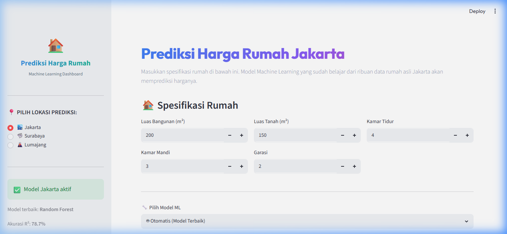
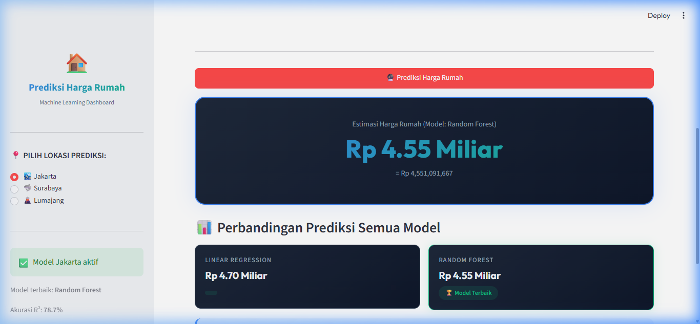
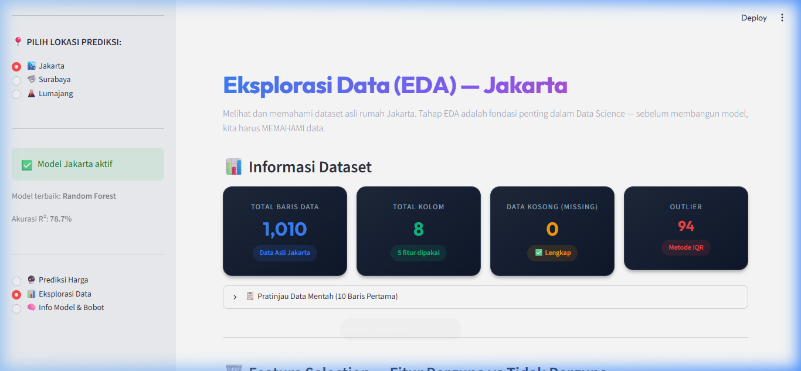
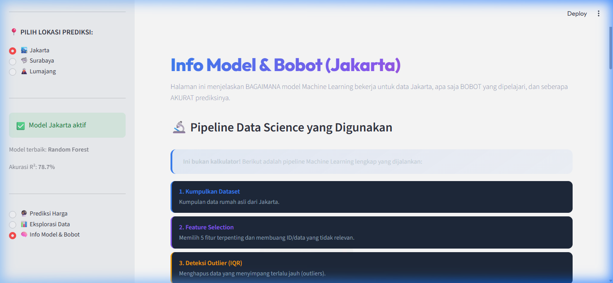
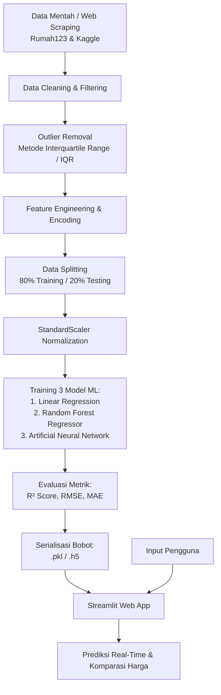

# 🏠 Prediksi Harga Rumah — Machine Learning Dashboard

> **Tugas Akhir Mata Kuliah Data Science**  
> Sistem Prediksi Harga Properti Berbasis *Machine Learning* Multi-Model (*Linear Regression, Random Forest, & Neural Network*) dengan Antarmuka Interaktif *Streamlit*.

[](https://www.python.org/)
[](https://streamlit.io/)
[](https://scikit-learn.org/)
[](https://tensorflow.org/)
[](https://pandas.pydata.org/)
[](https://plotly.com/)

---

## 📌 DAFTAR ISI
1. [Ringkasan Eksekutif](#-ringkasan-eksekutif)
2. [Data Science vs Machine Learning: Posisi Proyek Ini](#-data-science-vs-machine-learning-posisi-proyek-ini)
3. [Tangkapan Layar Aplikasi (Screenshots)](#-tangkapan-layar-aplikasi-screenshots)
4. [Arsitektur & Alur Kerja Sistem (End-to-End Pipeline)](#-arsitektur--alur-kerja-sistem-end-to-end-pipeline)
5. [Bagaimana Sistem Bekerja (Cara Kerja Teknis)](#-bagaimana-sistem-bekerja-cara-kerja-teknis)
6. [Tahapan Pembuatan Proyek](#-tahapan-pembuatan-proyek)
7. [Algoritma Model & Evaluasi Performa](#-algoritma-model--evaluasi-performa)
8. [Struktur Direktori](#-struktur-direktori)
9. [Panduan Instalasi & Menjalankan](#-panduan-instalasi--menjalankan)
10. [Glosarium & Panduan Tanya Jawab Sidang / Evaluasi](#-glosarium--panduan-tanya-jawab-sidang--evaluasi)

---

## 💡 Ringkasan Eksekutif

Proyek ini dibangun sebagai **Tugas Akhir Mata Kuliah Data Science**. Fokus utama proyek adalah menyelesaikan permasalahan nyata di industri properti: **menghilangkan bias subjektivitas dan asimetri informasi dalam penentuan estimasi harga rumah** di berbagai wilayah geografis (**Jakarta, Surabaya, dan Lumajang**).

Dengan memanfaatkan data historis listing properti nyata, sistem ini mengintegrasikan seluruh tahapan *data science lifecycle* dari ekstraksi data mentah hingga penyajian aplikasi prediksi harga secara instan dan transparan bagi pengguna umum.

---

## 🔬 Data Science vs Machine Learning: Posisi Proyek Ini

> **Pertanyaan Kunci:** *"Proyek ini untuk mata kuliah Data Science, tapi apakah sistem ini masuk ke Machine Learning?"*  
> **Jawabannya: YA, 100% BETUL!**

### Hubungan Keduanya:
- **Data Science** adalah disiplin ilmu payung (*umbrella discipline*) yang mencakup seluruh ekosistem pengolahan data: mulai dari perolehan data (*data collection*), pembersihan data (*data wrangling/cleaning*), eksplorasi statistik (*exploratory data analysis/EDA*), rekayasa fitur (*feature engineering*), hingga penarikan wawasan bisnis.
- **Machine Learning (ML)** adalah metodologi komputasi utama di dalam Data Science yang memberikan kemampuan kepada sistem untuk "belajar" dari pola historis tanpa perlu diprogram secara statis (rule-based).

```
┌─────────────────────────────────────────────────────────────┐
│                    DATA SCIENCE LIFECYCLE                   │
│                                                             │
│  [Data Scraping] ──> [Cleaning & IQR] ──> [EDA & Korelasi]  │
│                                                   │         │
│  ┌──────────────────────────────────────────────┐ │         │
│  │         MACHINE LEARNING CORE                │ │         │
│  │                                              ▼         │
│  │  [Feature Scaling] ──> [Training Model] ──> [Evaluasi] │ │
│  │                         (RF, LR, NN)          (R², MAE)│ │
│  └──────────────────────────────────────────────┘ │         │
│                                                   ▼         │
│                [Deployment & UI Dashboard Streamlit]        │
└─────────────────────────────────────────────────────────────┘
```

Proyek ini bukan sekadar kalkulator formula matematika buatan manusia, melainkan **sistem Data Science komprehensif yang inti prediksinya ditenagai oleh model Machine Learning** terlatih.

---

## 📸 Tangkapan Layar Aplikasi (Screenshots)

Berikut adalah dokumentasi antarmuka aplikasi yang berjalan di lingkungan lokal:

### 1. Dashboard Utama & Form Parameter Input
Menyediakan antarmuka input spesifikasi rumah: Luas Tanah ($m^2$), Luas Bangunan ($m^2$), Jumlah Kamar Tidur, Kamar Mandi, Garasi/Carport, dan legalitas sertifikat (SHM/HGB).


---

### 2. Hasil Prediksi & Komparasi Multi-Model
Menampilkan hasil estimasi nilai wajar properti menggunakan model terbaik (*Random Forest*), dilengkapi dengan perbandingan estimasi model pembanding (*Linear Regression*).


---

### 3. Eksplorasi Data (Exploratory Data Analysis - EDA)
Visualisasi interaktif sebaran data historis 1.010 unit rumah, matriks korelasi, penanganan nilai kosong, dan identifikasi pencilan (*outliers*).


---

### 4. Informasi Model, Arsitektur & Bobot Koefisien
Transparansi cara kerja model (*Explainable AI*), arsitektur model, evaluasi skor determinasi $R^2$, serta ranking kepentingan fitur (*feature importance*).


---

## ⚙️ Arsitektur & Alur Kerja Sistem (End-to-End Pipeline)

Sistem bekerja melalui alur data tertutup dari data mentah hingga inferensi real-time:



---

## 🔍 Bagaimana Sistem Bekerja (Cara Kerja Teknis)

Saat pengguna memasukkan spesifikasi rumah dan menekan tombol **"Prediksi Sekarang"**:

1. **Pengambilan Input Parameter**:
   Sistem membaca nilai dari form: Luas Bangunan, Luas Tanah, Kamar Tidur, Kamar Mandi, Garasi, serta kota yang dipilih (Jakarta, Surabaya, atau Lumajang).
2. **Kategorisasi & Encoding**:
   Fitur non-numerik (seperti jenis sertifikat atau sub-lokasi wilayah) dikonversi menjadi format representasi numerik menggunakan encoder tersimpan (`encoders.pkl`).
3. **Standarisasi Fitur (Feature Scaling)**:
   Karena setiap variabel memiliki skala berbeda (contoh: luas ratusan $m^2$ vs jumlah kamar satuan), input dinormalisasi dengan `scaler.pkl` (*StandardScaler*) yang dilatih pada dataset kota terkait:
   $$z = \frac{x - \mu}{\sigma}$$
4. **Inferensi Model Terlatih**:
   Vektor fitur terstandarisasi diumpankan ke model:
   - **Random Forest Regressor** (`model_rf.pkl`): Melakukan inferensi melalui *ensemble* pohon keputusan acak.
   - **Linear Regression** (`model_lr.pkl`): Menghitung kombinasi linear bobot $\beta$:
     $$\hat{y} = \beta_0 + \beta_1 x_1 + \beta_2 x_2 + \dots + \beta_n x_n$$
   - **Neural Network / MLP** (`model_nn.h5`): Melewatkan data melalui dense layers dengan aktivasi ReLU.
5. **Inversi Nilai Target (De-scaling)**:
   Output prediksi yang awalnya dalam skala terstandarisasi dikembalikan ke nilai nominal Rupiah asli.
6. **Penyajian Hasil & Rekomendasi**:
   Hasil prediksi ditampilkan dalam satuan Rupiah (Miliar/Juta), lengkap dengan visualisasi komparasi antar model dan batas toleransi estimasi.

---

## 🛠️ Tahapan Pembuatan Proyek

Proyek ini dibangun melalui 5 fase terstruktur:

### Tahap 1: Pengumpulan Data (*Data Collection*)
- Data properti kota metropolitan (Jakarta dan Surabaya) dikumpulkan dari dataset pasar properti sekunder.
- Data properti lokal (Lumajang) dikumpulkan secara mandiri menggunakan skrip web scraping otomatis berbasis Python Selenium (`scraper_lumajang.py`) pada portal Rumah123.

### Tahap 2: Prapemrosesan & Pembersihan Data (*Preprocessing*)
- **Pembersihan String**: Mengonversi teks harga (misal: "Rp 1,5 Milyar", "850 Jt") menjadi angka murni (`float`).
- **Penanganan Missing Values**: Mengisi atau mengeliminasi baris data yang memiliki nilai null pada fitur penentu.
- **Deteksi & Eliminasi Outlier**: Menggunakan batas Interquartile Range (IQR):
  $$\text{IQR} = Q_3 - Q_1$$
  $$\text{Batas Bawah} = Q_1 - 1.5 \times \text{IQR}, \quad \text{Batas Atas} = Q_3 + 1.5 \times \text{IQR}$$
  Langkah ini krusial agar model tidak bias akibat rumah mewah ekstrem (outlier harga ratusan miliar) yang dapat merusak gradien model regresi.

### Tahap 3: Pemodelan Machine Learning (*Model Training*)
- Pelatihan dilakukan menggunakan notebook eksperimen (`notebook/`).
- Data dibagi menjadi **80% Training Set** untuk proses belajar dan **20% Testing Set** untuk evaluasi independen.
- Tiga model dilatih secara paralel untuk membandingkan karakteristik algoritma linear, ensemble non-linear, dan deep learning.

### Tahap 4: Serialisasi Model
- Objek model, parameter normalisasi, dan kamus metadata disimpan menggunakan pustaka `joblib` (`.pkl`) dan format Keras HDF5 (`.h5`) di direktori `models/<kota>/`.
- Pendekatan ini memungkinkan *decoupling*: training model dilakukan sekali di cloud/offline, sementara aplikasi web hanya membaca bobot yang sudah matang tanpa perlu training ulang saat dijalankan.

### Tahap 5: Pengembangan Antarmuka (*Front-End & Deployment*)
- UI dirancang menggunakan framework **Streamlit** dengan modularitas kode terpisah (`frontend/` dan `engine/`).
- Desain modern menggunakan CSS kustom dengan responsivitas tinggi, visualisasi interaktif Plotly, dan indikator performa model.

---

## 📊 Algoritma Model & Evaluasi Performa

| Algoritma | Tipe Model | Keunggulan Utama | Limitasi |
| :--- | :--- | :--- | :--- |
| **Linear Regression** | Parametrik Linear | Sangat cepat, koefisien mudah diinterpretasikan | Tidak dapat menangkap korelasi non-linear yang rumit |
| **Random Forest** | Ensemble Tree Non-Linear | Akurasi tinggi, tahan outlier/overfitting, menghasilkan *feature importance* | Ukuran file bobot lebih besar |
| **Neural Network (MLP)** | Deep Learning | Mampu mengekstrak representasi fitur berdimensi tinggi | Memerlukan volume data besar agar optimal |

### Metrik Evaluasi yang Digunakan:
1. **Koefisien Determinasi ($R^2$ Score)**:
   $$R^2 = 1 - \frac{\sum (y_i - \hat{y}_i)^2}{\sum (y_i - \bar{y})^2}$$
   Mengukur persentase variasi harga yang berhasil dijelaskan oleh fitur-fitur model.
2. **Mean Absolute Error (MAE)**:
   $$\text{MAE} = \frac{1}{n}\sum_{i=1}^n |y_i - \hat{y}_i|$$
   Menghitung rata-rata selisih mutlak nominal antara estimasi model dan harga riil pasar.

---

## 📁 Struktur Direktori

```text
prediksi_harga_rumah/
│
├── dataset/                    # Data mentah & dataset hasil pembersihan (CSV)
│   ├── data_jakarta.csv
│   ├── data_surabaya.csv
│   └── data_lumajang.csv
│
├── engine/                     # Backend logic & loader model
│   ├── __init__.py
│   └── model_loader.py         # Fungsi pemuatan .pkl, .h5, dan scaler
│
├── frontend/                   # Modul antarmuka Streamlit
│   ├── __init__.py
│   ├── styles.py               # Injeksi CSS & styling modern
│   ├── page_predict.py         # Halaman form & hasil prediksi
│   ├── page_explore.py         # Halaman Eksplorasi Data (EDA)
│   └── page_model_info.py      # Halaman arsitektur & bobot model
│
├── models/                     # Bobot Machine Learning tersimpan (.pkl / .h5)
│   ├── jakarta/
│   ├── surabaya/
│   └── lumajang/
│
├── notebook/                   # Jupyter Notebook proses training & EDA
│   ├── Training_Jakarta.ipynb
│   ├── Training_Surabaya.ipynb
│   └── Training_Lumajang.ipynb
│
├── penjelasan/                 # Panduan teknis, dokumentasi & glosarium sidang
├── screenshots/                # Tangkapan layar antarmuka dashboard
├── app.py                      # File utama aplikasi Streamlit
├── scraper_lumajang.py         # Skrip Web Scraper Selenium untuk Rumah123
├── requirements.txt            # Daftar pustaka Python yang dibutuhkan
└── README.md                   # Dokumentasi utama proyek
```

---

## 🚀 Panduan Instalasi & Menjalankan

### 1. Prasyarat Sistem
- Python versi 3.9 s/d 3.11
- Git

### 2. Clone Repositori
```bash
git clone https://github.com/AbdurRouf05/prediksi_harga_rumah.git
cd prediksi_harga_rumah
```

### 3. Buat dan Aktifkan Virtual Environment (Opsional tapi Disarankan)
```bash
# Windows
python -m venv venv
venv\Scripts\activate

# Linux / MacOS
python3 -m venv venv
source venv/bin/activate
```

### 4. Instalasi Dependensi
```bash
pip install -r requirements.txt
```

### 5. Jalankan Aplikasi
```bash
python -m streamlit run app.py
```
Buka peramban (*browser*) pada alamat: **`http://localhost:8501`**.

---

## 🎓 Glosarium & Panduan Tanya Jawab Sidang / Evaluasi

Berikut adalah rangkuman konsep penting yang sering ditanyakan saat presentasi atau sidang akademik:

1. **"Mengapa proyek ini disebut proyek Data Science, bukan hanya aplikasi Web?"**
   > *Karena inti nilai tambah dari sistem ini adalah pada siklus pengelolaan datanya: mulai dari pengumpulan data mentah (*scraping*), pembersihan missing values & outlier, rekayasa fitur (*StandardScaler*), pelatihan algoritma Machine Learning, evaluasi metrik $R^2$, hingga serialisasi model. Antarmuka web hanyalah media hilir (*deployment*) agar hasil pemodelan data science dapat dimanfaatkan oleh pengguna.*

2. **"Mengapa menggunakan Random Forest di samping Linear Regression?"**
   > *Harga properti tidak berbanding lurus secara kaku (*non-linear*). Interaksi antara luas bangunan, lokasi, dan jumlah fasilitas seringkali membentuk pola bersarang. Random Forest sebagai algoritma ensemble berbasis pohon keputusan mampu memodelkan relasi non-linear tersebut secara presisi serta memberikan analisis Feature Importance.*

3. **"Mengapa outlier perlu dibuang dengan metode IQR?"**
   > *Outlier ekstrem (misalnya rumah mewah seharga Rp 100+ miliar di tengah pemukiman umum) dapat menarik garis regresi secara drastis (*high leverage points*). Menghilangkan data pencilan dengan metode 1.5 × IQR membuat model lebih stabil dan representatif bagi pasar mayoritas masyarakat.*

4. **"Mengapa fitur harus di-scaling menggunakan StandardScaler?"**
   > *Fitur memiliki skala unit yang jauh berbeda (contoh: Luas Bangunan berorde ratusan $m^2$, sedangkan Kamar Tidur berorde satuan). Tanpa normalisasi, model seperti Linear Regression atau Neural Network akan memberikan bobot yang tidak adil kepada fitur dengan angka terbesar semata, bukan karena korelasinya.*

---

<div align="center">
  <b>Dibuat untuk Tugas Akhir Mata Kuliah Data Science</b><br>
  <i>Prediksi Harga Rumah — Machine Learning Dashboard</i>
</div>
