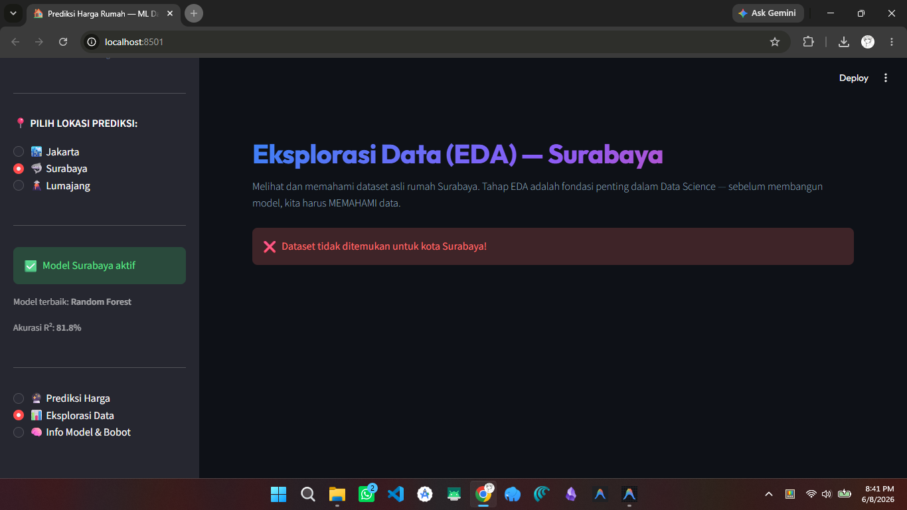

# 🚀 CARA MENJALANKAN PROJECT

## A. Menjalankan Website (Streamlit Dashboard)

### Prasyarat:
1. Python 3.8+ terinstal
2. Library sudah diinstal

### Langkah:
```bash
# 1. Buka terminal di folder project
cd "d:\kuliah\data science\uas_project akhir\prediksi_harga_rumah"

# 2. Instal semua library yang dibutuhkan
pip install -r requirements.txt

# 3. Jalankan website

```

Website akan terbuka di browser: `http://localhost:8501`

### Catatan Penting:
- Pastikan folder `models/<kota>/` sudah berisi file `.pkl` dan `.h5`
- Jika model belum ada, website akan menampilkan pesan error
- Untuk mendapatkan model, jalankan Notebook Training di Colab terlebih dahulu


---

## B. Melatih Model (Google Colab)

### Langkah:
1. Buka [Google Colab](https://colab.research.google.com/)
2. Upload file `.ipynb` dari folder `notebook/` 
   (contoh: `Training_Jakarta.ipynb`)
3. Klik **"Runtime" → "Run All"** (atau Ctrl+F9)
4. Saat muncul tombol upload, pilih file CSV dari folder `dataset/`
5. Tunggu semua sel selesai berjalan (~2-5 menit)
6. File ZIP akan otomatis ter-download
7. Ekstrak isi ZIP ke folder `models/<kota>/`

### Contoh untuk Jakarta:
```
1. Upload Training_Jakarta.ipynb ke Colab
2. Run All
3. Upload DATA_RUMAH.csv saat diminta
4. Tunggu training selesai
5. Download jakarta_models.zip (otomatis)
6. Ekstrak isi ZIP ke: models/jakarta/
   - model_rf.pkl
   - model_lr.pkl
   - model_nn.h5
   - scaler.pkl
   - encoders.pkl
   - metadata.pkl
```


---

## C. Menjalankan Scraper Lumajang

### Prasyarat:
1. Google Chrome terinstal
2. ChromeDriver sesuai versi Chrome
3. Library Selenium terinstal: `pip install selenium`

### Langkah:
```bash
cd "d:\kuliah\data science\uas_project akhir\prediksi_harga_rumah"
python scraper_lumajang.py
```

### Apa yang Terjadi:
1. Chrome akan terbuka secara otomatis (dikendalikan bot)
2. Bot membuka halaman pencarian rumah di rumah123.com (area Lumajang)
3. Bot mengumpulkan semua URL rumah dari beberapa halaman
4. Bot membuka setiap rumah satu per satu (deep scraping)
5. Bot mengekstrak detail: Luas, Kamar, Sertifikat, Daya Listrik, dll.
6. Data disimpan ke `dataset/lumajang/DATA_RUMAH_LUMAJANG_DEEP.csv`

**Durasi:** ~10-15 menit (tergantung jumlah listing)
**Jangan** tutup Chrome atau matikan laptop selama proses berjalan!


---

## D. Urutan Kerja Lengkap (Dari Nol)

```
1. [Opsional] Jalankan scraper_lumajang.py  →  Dapat dataset Lumajang
2. Upload Notebook ke Colab
3. Run All di Colab  →  Download ZIP model
4. Ekstrak ZIP ke folder models/<kota>/
5. Jalankan: streamlit run app.py
6. Buka browser: http://localhost:8501
7. Pilih kota → Masukkan spesifikasi rumah → Lihat prediksi!
```


---

## E. Troubleshooting (Masalah Umum)

### "ModuleNotFoundError: No module named 'streamlit'"
```bash
pip install streamlit
```

### "Model belum dimuat" / "Scaler tidak ditemukan"
- Pastikan folder `models/<kota>/` berisi file `.pkl`
- Jika belum ada, jalankan Notebook Training di Colab dulu

### "TensorFlow error"
```bash
pip install tensorflow
```

### Scraper error: "ChromeDriver not found"
- Download ChromeDriver dari: https://chromedriver.chromium.org/
- Pastikan versinya sesuai dengan versi Chrome Anda
- Letakkan di PATH atau di folder project


---

## F. Tips Presentasi / Sidang

1. **Demo Live:** Jalankan `streamlit run app.py` dan tunjukkan prediksi real-time
2. **Jelaskan EDA:** Buka halaman "Eksplorasi Data" untuk menunjukkan pemahaman data
3. **Jelaskan Feature Selection:** Tunjukkan tabel fitur berguna vs tidak berguna
4. **Tunjukkan Feature Importance:** Jelaskan fitur mana yang paling berpengaruh
5. **Bandingkan Model:** Tunjukkan skor R² ketiga model dan jelaskan mengapa 
   Random Forest biasanya menang
6. **Tunjukkan Notebook:** Buka Colab dan tunjukkan pipeline dari awal hingga akhir
7. **Jelaskan Keterbatasan:** Data Lumajang terbatas, model mungkin kurang akurat 
   untuk rumah di luar range data training
